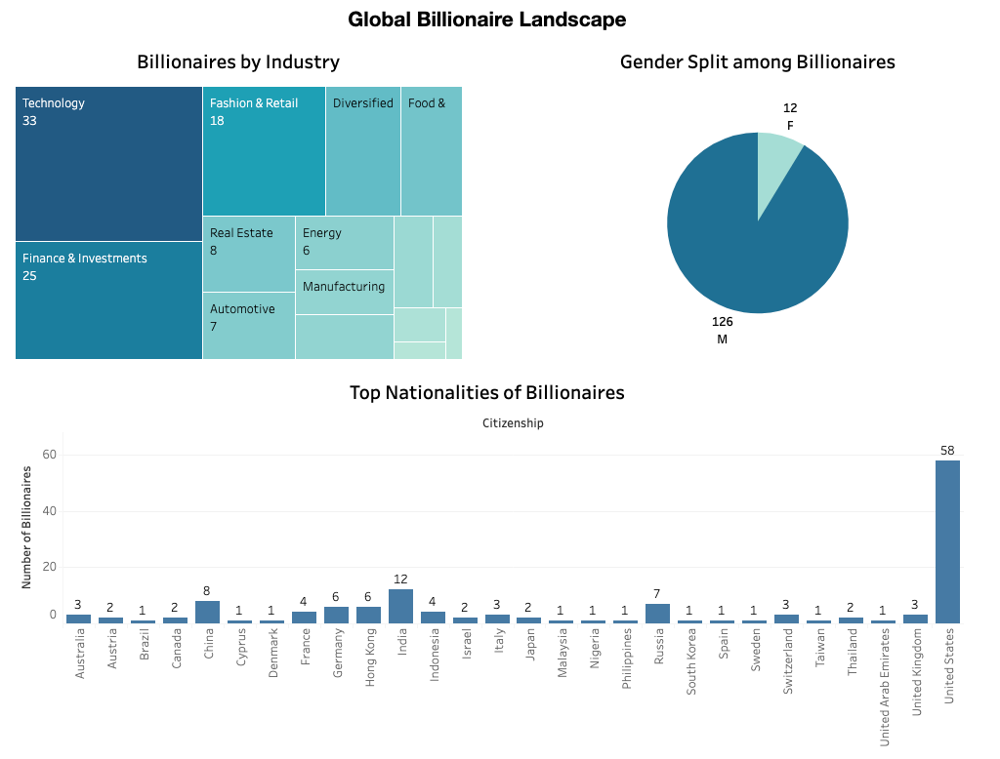
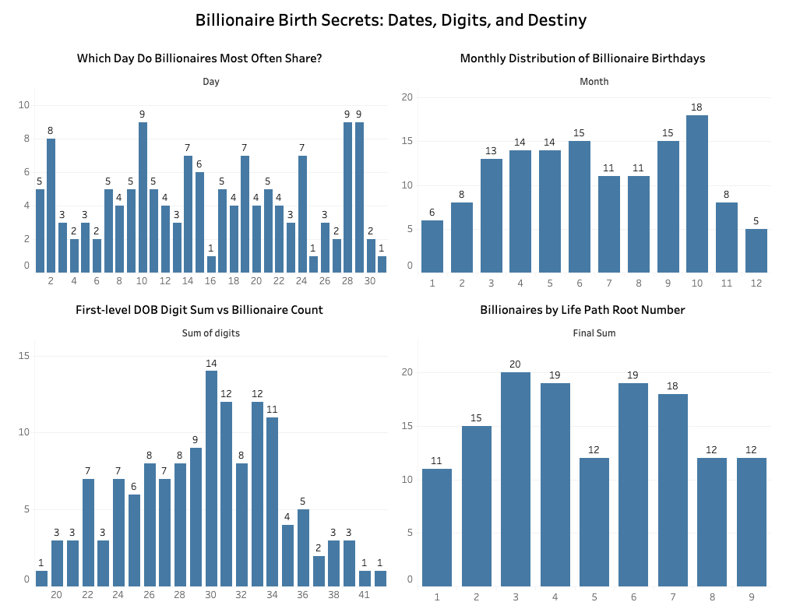

# Billionaire Birth Analysis

This project explores birth-related patterns among global billionaires, analyzing their dates of birth, industries, genders, and citizenship. Using Excel and Tableau, we visualize trends and numerological patterns from a curated dataset of 138 billionaires.

## Project Structure

- `billionaires_birth_data.xlsx`: Raw dataset containing names, DOBs, industries, citizenships, and genders.
- `billionaire_demographic.twbx`: Tableau workbook with interactive dashboards.
- `dashboard1_preview.png`, `dashboard2_preview.png: Image previews of the Tableau dashboard.

## Dashboards Overview

### 1. Global Billionaire Landscape
- Industries with Most Billionaires
- Gender Distribution (M vs F)
- Citizenship Count by Country

### 2. Billionaire Birth Secrets: Dates, Digits, and Destiny
- Births by Day of Month
- Births by Month
- Numerology Root Numbers (1–9)
- First-Level Digit Sum of DOB

## Key Insights

- The highest number of billionaires come from the Technology and Finance & Investments sectors.
- As expected, the United States has the largest share of billionaires by citizenship.
- Among all dates, the 10th, 28th, and 29th of the month show slightly higher frequencies of billionaire birthdays. October stands out as the month with the most birthdays overall.
- In the numerology-inspired analysis, a digit sum of 30 appeared most frequently among the dataset, while the most common Life Path Number (final reduced sum) was 3.

## Caution

The insights above are purely observational and speculative—they do not imply causation. While this project explores whether any patterns exist in billionaire birth data, most distributions are fairly even with only mild variations. Date of birth should not be viewed as a determinant of success, and the visualizations are meant for exploratory and educational purposes only.
 

## How to Explore

1. Open `billionaire_demographic.twbx` in Tableau Desktop or Tableau Public.
2. Interact with filters, hover over charts, and explore hidden patterns.
3. Use `billionaires_birth_data.xlsx` to extend the analysis or clean data further.

## Tools Used

- Excel: Data cleaning and digit-sum calculations
- Tableau: Dashboard creation and visualization
- GitHub: Project hosting

## Preview

## License

[MIT License](LICENSE) – free to use, modify, and distribute with attribution.

## Author

**Sai Srikar Puppala**  
[LinkedIn](https://www.linkedin.com/in/puppalasaisrikar/)  
[GitHub](https://github.com/puppalasaisrikar)

## Disclaimer

This is a **personal exploratory project** and does not claim to reflect an accurate or comprehensive picture of the billionaire population. Some individuals were excluded from the analysis due to missing or unverifiable date of birth information. The visualizations and insights presented are based solely on the available dataset and should not be interpreted as definitive or authoritative.

